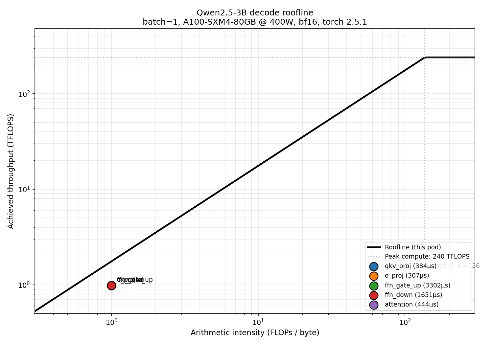
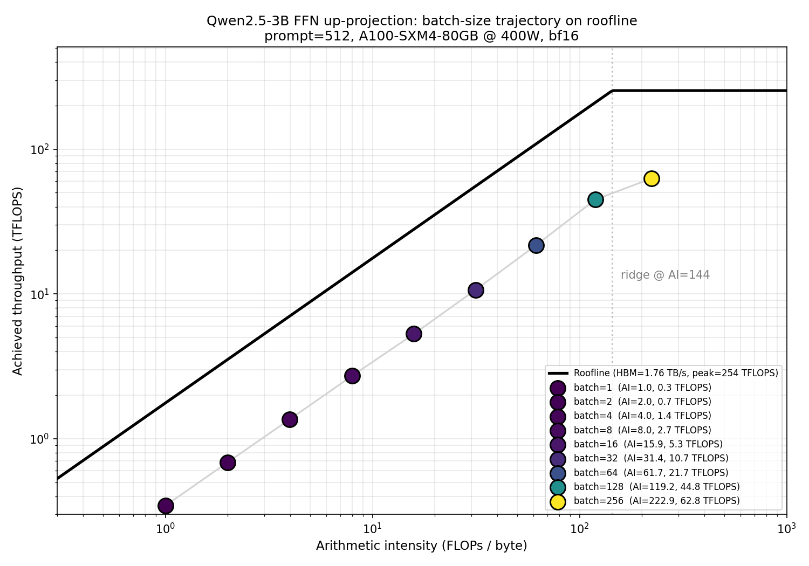

# inference-opt

LLM inference optimization on a single GPU. One of three projects in a portfolio
targeting inference performance engineering roles.



## Project overview

Take Qwen2.5-3B and measurably improve its serving performance on a single
A100 80GB through:

1. **Profiling + roofline analysis** to identify bottlenecks (Week 1 — complete)
2. **Batching analysis** to measure arithmetic-intensity shift (Week 2 — next)
3. **KV cache quantization** (FP16 → FP8) with quality tracking (Week 3)
4. **Custom Triton kernel** for a fused attention variant (Week 4)

## Week 1 — Baseline and roofline

**Hardware:** NVIDIA A100-SXM4-80GB (400W cap), bf16, torch 2.5.1+cu121.

Measured ceilings via `scripts/00_microbench.py`:
- HBM bandwidth: **1.76 TB/s** (86% of 2.04 TB/s theoretical peak)
- Peak FP16 tensor core: **240 TFLOPS** (77% of 312 TFLOPS peak)
- Ridge point: **136 FLOPs/byte**

### Baseline sweep

| Config | TTFT (ms) | TPOT (ms) | Throughput (tok/s) |
|---|---|---|---|
| batch=1, prompt=128  | 27  | 26.4 | 38   |
| batch=1, prompt=2048 | 81  | 26.4 | 37   |
| batch=1, prompt=8192 | 331 | 26.4 | 35   |
| batch=4, prompt=512  | 78  | 26.8 | 147  |
| batch=16, prompt=512 | 280 | 26.7 | 556  |
| batch=64, prompt=512 | 1095 | 26.3 | 1843 |

Raw data: [`results/baseline/summary.csv`](results/baseline/summary.csv).

### Key findings

**Decode is memory-bound.** TPOT is nearly flat across batch 1 → 64
(26.4 → 26.3 ms). The GPU spends most of its decode time waiting for
HBM reads, not doing arithmetic. Adding concurrent users doesn't affect
per-token latency because the bottleneck is weight loading, not
compute.

**Batching amortizes weight loads.** Throughput scales 48× when batch
scales 64×, because weights are read from HBM once and reused across
the batch. This is the fundamental economic argument for continuous
batching in production serving.

**Prefill scales linearly until O(N²) attention dominates.** TTFT grows
linearly with prompt length up to ~2K tokens, superlinearly after that
(QKᵀ cost kicks in).

### Roofline analysis

All four linear projection categories sit at **AI ≈ 1 FLOP/byte** — the
mathematical signature of matrix-vector products at batch=1. They
achieve ~1 TFLOPS, roughly 56% of the memory-bound ceiling at that AI.

**Attention** sits at AI ≈ 8 but achieves only 2.5% of its ceiling,
suggesting significant kernel launch overhead at these tiny decode
shapes — attention kernels are complex but process very few tokens, so
most of their time isn't spent doing the work they're shaped for.

The roofline plot makes the optimization roadmap visual. The entire
compute-bound region of the plot (right of AI=136) is unused. Every
Week 2–4 intervention is a strategy to move workload points either **up**
(use available bandwidth more efficiently) or **right** (do more
arithmetic per byte via batching, fusion, or quantization).


## Week 2 — Batching analysis

**Question:** how does decode performance scale with batch size, and where does the workload transition from memory-bound to compute-bound?

**Hardware:** Same A100-SXM4-80GB (400W cap), this pod's measured ridge point: **144 FLOPs/byte**.

### Sweep

Batch sizes 1–256, prompt=512, output=128. Same harness as Week 1.

| Batch | TTFT (ms) | TPOT (ms) | Throughput (tok/s) | Peak mem (GB) | Analytical AI (FFN) |
|---|---|---|---|---|---|
| 1   | 28.5  | 26.9 | 36   | 6.4  | 1.0 |
| 8   | 146   | 27.3 | 279  | 7.6  | 8.0 |
| 16  | 282   | 28.0 | 527  | 9.0  | 15.9 |
| 64  | 1104  | 27.3 | 1776 | 17.5 | 61.7 |
| 128 | 2208  | **26.4** | 2920 | 28.8 | 119.2 |
| 256 | 4425  | **37.7** | 3560 | 51.4 | **222.9** |

Raw data: [`results/batching/summary.csv`](results/batching/summary.csv).

### Key findings

**TPOT is invariant under batching from 1 → 128.** Per-token decode latency stays in a tight 26.4–28.0 ms band as batch grows from 1 to 128. Each weight matrix is loaded from HBM once per step regardless of batch size, so adding concurrent users doesn't slow them down. Weight amortization made concrete.

**The ridge crossing is empirically visible at batch=256.** TPOT jumps from 26.4 ms (batch=128) to 37.7 ms (batch=256) — a 43% latency increase. The analytical FFN-up arithmetic intensity at batch=256 is **223 FLOPs/byte**, which crosses this pod's measured ridge point of 144. Below the ridge: extra batch is free in latency. Above the ridge: extra batch is paid in compute.

**Throughput grows ~100×, but with diminishing per-user returns.** Aggregate throughput climbs from 36 to 3560 tok/s — yet per-user effective throughput (which includes prefill amortized over the run) falls from 36 to 14 tok/s. The cost-efficiency knee sits between **batch=64 and batch=128**, where users still get ~23 tok/s while the system serves at near-peak throughput.

**TTFT scales linearly with batch.** Prefill is compute-bound from the start (it's a real `(B×seq, hidden) @ (hidden, out)` matmul, not a gemv). Doubling the batch doubles the work and doubles TTFT. This is why production serving systems use *continuous batching* — the static-batching prefill tax we're paying here is what continuous batching exists to amortize away.

### The trajectory roofline



The plot tracks the FFN up-projection across all batch sizes. As batch grows the point slides right (AI scales linearly with batch via weight amortization) and up (achieved TFLOPS rises in proportion as the ceiling rises). The trajectory hugs the memory-bound slope through batch=128, then approaches the compute ceiling at batch=256.

### Caveats and methodology notes

- **Roofline framework choice.** Roofline analysis can be applied at either the per-operator level (one point per op) or the aggregate forward-pass level (single point summarizing the whole workload). We chose per-op because it's more actionable: different operators sit at different points and call for different optimizations. Aggregate AI hides that distinction.
- **Achieved-TFLOPS estimation.** PyTorch Profiler reports per-op time but `aten::mm` aggregates over all matmul shapes. We can't cleanly extract "FFN up-projection time" from the profile, so we apportion linear-op time by FLOP share — assumes equal kernel efficiency across linear ops. Trajectory shape is robust to this; absolute TFLOPS values are approximate.
- **Static vs continuous batching.** We use static batching (everyone starts together, finishes together). Production systems use continuous batching which interleaves prefill and decode, hiding the prefill tax. Continuous batching would change the throughput numbers; the per-token decode story is the same.
- **OOM boundary not measured.** Sweep stopped at batch=256 by configuration. We used 51 GB of the 80 GB available there — could have pushed further but the ridge crossing was already clear.


## Repository layout

```
inference-opt/
├── src/inference_opt/          # library: model loading, benchmark harness, utils
├── scripts/
│   ├── 00_microbench.py        # measure this pod's HBM + compute ceilings
│   ├── 01_sanity_check.py      # verify the model runs
│   ├── 02_benchmark_baseline.py  # TTFT/TPOT/throughput sweep
│   ├── 03_profile_target.py    # NVTX-wrapped minimal decode target (for ncu)
│   ├── 04_profile_pytorch.py   # torch.profiler based profiling
│   └── 05_roofline_plot.py     # analytical roofline construction + plot
├── results/baseline/
│   ├── microbench.json         # measured hardware ceilings (per pod)
│   ├── summary.csv             # baseline sweep results
│   ├── profile/                # per-op PyTorch Profiler output
│   └── roofline.png            # headline plot
├── NOTES.md                    # engineering log, observations, gotchas
├── RUNBOOK.md                  # pod setup and reproduction instructions
└── pyproject.toml
```

## Reproducing

Pod setup is non-trivial due to RunPod-specific behaviors — see
[`RUNBOOK.md`](RUNBOOK.md) for the verified startup sequence.

Once the pod is set up:

```bash
python scripts/00_microbench.py       # measures this pod's ceilings (~30s)
python scripts/02_benchmark_baseline.py   # baseline sweep (~10 min)
python scripts/04_profile_pytorch.py  # per-op profile (~30s)
python scripts/05_roofline_plot.py    # render plot (~2s)
```

## Methodology notes

See [`NOTES.md`](NOTES.md) for engineering observations including:
- Decode-time variance across nominally-identical A100 pods (launch
  overhead dominates at batch=1, so host-level variance matters)
- Why we use analytical FLOPs/bytes instead of Nsight Compute
  measurements (RunPod Community Cloud blocks GPU performance counter
  access)
- Why all roofline ceilings come from per-pod microbench, not datasheet
  peaks
